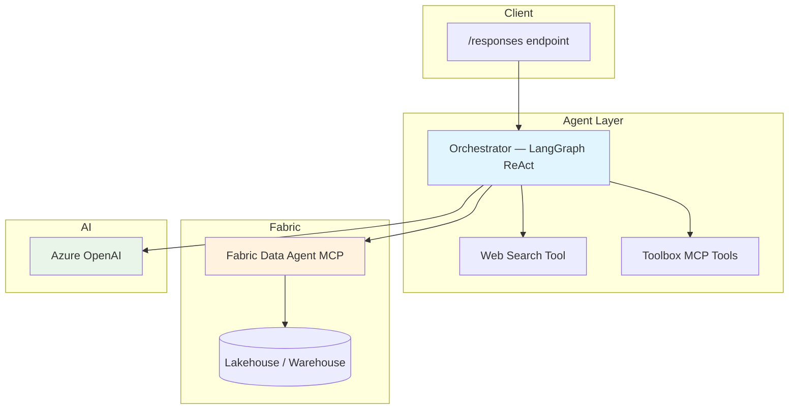

# Fabric Data Agent — LangGraph + MCP + Foundry Toolbox

[](https://langchain-ai.github.io/langgraph/) [](https://www.microsoft.com/microsoft-fabric) [](https://azure.microsoft.com/services/openai/)

A LangGraph ReAct agent that connects to a **Microsoft Fabric Data Agent** via its MCP endpoint, deployed on **Microsoft Foundry** with optional toolbox integration for web search, code interpreter, and AI search.

## Features

- **Fabric Data Agent (MCP)** — queries data in Fabric lakehouses, warehouses, and semantic models through the Fabric Data Agent's MCP-compatible endpoint
- **Toolbox MCP integration** — connects to a Foundry toolbox for additional tools (web search, code interpreter, AI search)
- **Web search** — built-in Bing web search via Azure OpenAI Responses API for real-time information
- **Responses Protocol** — serves requests on port `8088` via `ResponsesAgentServerHost`
- **Multi-turn conversation** — maintains context across turns with history support

## Architecture



## Quick Start (Local)

```bash
# 1. Copy and fill in the environment file
cp .env.example .env
# Edit .env — set FOUNDRY_PROJECT_ENDPOINT, AZURE_AI_MODEL_DEPLOYMENT_NAME,
# and FABRIC_MCP_ENDPOINT

# 2. Install dependencies
pip install -r requirements.txt

# 3. Start the agent
python main.py

# 4. Invoke
curl -X POST http://localhost:8088/responses \
  -H "Content-Type: application/json" \
  -d '{"input": "What tables are available in the data?"}'
```

## Deploy as a Hosted Agent

### Prerequisites

- Azure Developer CLI (`azd`) — [install docs](https://learn.microsoft.com/azure/developer/azure-developer-cli/install-azd)
- AI Agents extension: `azd extension install azure.ai.agents`
- Azure login: `azd auth login`

### Deploy

```bash
# 1. Set required environment variables
azd env set AZURE_AI_MODEL_DEPLOYMENT_NAME "gpt-4o" -e my-env
azd env set FABRIC_MCP_ENDPOINT "https://api.fabric.microsoft.com/v1/mcp/workspaces/<workspace-id>/dataagents/<dataagent-id>/agent" -e my-env

# 2. Provision infrastructure and deploy
azd up -e my-env

# 3. Invoke the deployed agent
azd ai agent invoke --new-session "What data is available?" --timeout 120
```

## Environment Variables

| Variable | Required | Description |
|----------|----------|-------------|
| `FOUNDRY_PROJECT_ENDPOINT` | **Yes** | Foundry project endpoint — platform-injected at runtime |
| `AZURE_AI_MODEL_DEPLOYMENT_NAME` | **Yes** | Model deployment name (e.g. `gpt-4o`) |
| `FABRIC_MCP_ENDPOINT` | **Yes** | Fabric Data Agent MCP endpoint URL |
| `TOOLBOX_NAME` | No | Toolbox name — constructs the MCP endpoint automatically |
| `TOOLBOX_ENDPOINT` | No | Full toolbox MCP endpoint URL (alternative to `TOOLBOX_NAME`) |

## Project Structure

```
├── main.py                      # Agent entry point + Responses Protocol server
├── orchestrator.py              # LangGraph ReAct agent builder (MCP + web search)
├── tools/
│   └── web_search.py            # Bing web search via Azure OpenAI Responses API
├── SYSTEM_PROMPT.md             # Agent system prompt
├── agent.yaml                   # Foundry agent definition
├── agent.manifest.yaml          # Toolbox manifest (web_search, code_interpreter, ai_search)
├── Dockerfile                   # Container build
├── requirements.txt             # Python dependencies
└── azure.yaml                   # azd deployment configuration
```

## Fabric Data Agent

The agent connects to a [Microsoft Fabric Data Agent](https://learn.microsoft.com/fabric/data-engineering/data-agent-concept) via its MCP endpoint. The Fabric Data Agent exposes tools that allow the LLM to query data stored in Fabric lakehouses, warehouses, and semantic models.

Authentication uses `DefaultAzureCredential` with the `https://api.fabric.microsoft.com/.default` scope.

## Toolbox Configuration

The toolbox is configured in `azure.yaml` and `agent.manifest.yaml`. The manifest declares tools in the `agent-tools` toolbox: `web_search`, `code_interpreter`, and `azure_ai_search`. These are **optional** — the Fabric Data Agent tools work independently of the toolbox.

## Contributing

This project welcomes contributions and suggestions.

## License

See [LICENSE.md](LICENSE.md).
