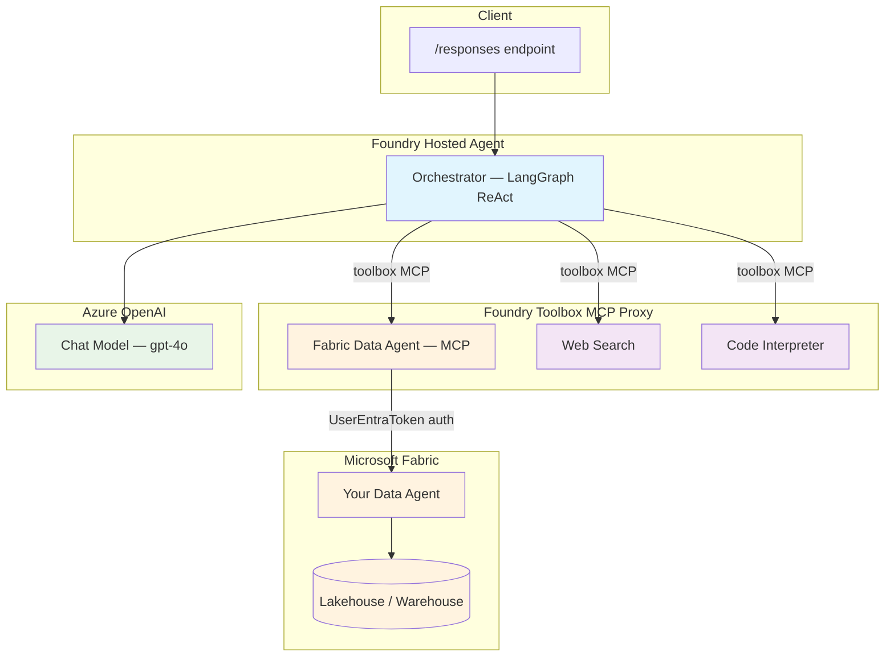

# LangGraph + Fabric Data Agent — Foundry Toolbox Template

[](https://langchain-ai.github.io/langgraph/) [](https://www.microsoft.com/microsoft-fabric) [](https://azure.microsoft.com/services/openai/)

A **template** for building LangGraph ReAct agents on **Microsoft Foundry** that query data through any **Microsoft Fabric Data Agent** — connected via MCP through the Foundry toolbox — plus platform-managed web search and code interpreter.

> **Included example:** This repo ships pre-configured with an **InsuranceGold** Fabric Data Agent (`DataAgent_insurance360`) that exposes insurance tables (agents, claims, sales, commissions, products). Replace it with your own Data Agent by following the [Bring Your Own Data Agent](#bring-your-own-data-agent) guide below.

---

## Table of Contents

- [Features](#features)
- [Architecture](#architecture)
- [How It Works](#how-it-works)
- [Included Example: InsuranceGold](#included-example-insurancegold)
- [Bring Your Own Data Agent](#bring-your-own-data-agent)
- [Deploy as a Hosted Agent](#deploy-as-a-hosted-agent)
  - [Option A: Deploy to a New AI Foundry Project](#option-a-deploy-to-a-new-ai-foundry-project)
  - [Option B: Deploy to an Existing AI Foundry Project](#option-b-deploy-to-an-existing-ai-foundry-project)
  - [Configuration Files Reference](#configuration-files-reference)
  - [azd Environment Variables Reference](#azd-environment-variables-reference)
- [Quick Start (Local)](#quick-start-local)
- [Environment Variables](#environment-variables)
- [Project Structure](#project-structure)
- [Toolbox Configuration](#toolbox-configuration)
- [Key Technical Notes](#key-technical-notes)
- [Langfuse Observability (Optional)](#langfuse-observability-optional)
- [Contributing](#contributing)
- [License](#license)

---

## Features

- **Any Fabric Data Agent via Toolbox** — connect any Fabric Data Agent as an MCP tool through the Foundry toolbox; the agent code itself is data-agnostic
- **Foundry Toolbox** — all tools (Fabric Data Agent, web search, code interpreter) are platform-managed via a single MCP proxy endpoint
- **Zero in-app auth code** — the Foundry platform handles token acquisition and MCP proxying
- **Responses Protocol** — serves requests on port `8088` via `ResponsesAgentServerHost`
- **Multi-turn conversation** — maintains context across turns with history support

## Architecture



## How It Works

The agent code contains **no Fabric-specific logic**. All data access is handled by the Foundry toolbox:

1. The agent connects to a single **Foundry Toolbox MCP endpoint** at startup
2. The toolbox exposes your **Fabric Data Agent** as an MCP tool alongside web search and code interpreter
3. When the agent calls the Fabric tool, the **Foundry platform exchanges the user's token** for a Fabric-scoped token and proxies the MCP request
4. The Fabric Data Agent translates natural language queries into SQL, executes them, and returns results

---

## Included Example: InsuranceGold

This repo comes pre-wired with a Fabric Data Agent named **InsuranceGold** (`DataAgent_insurance360`) that exposes 8 tables:

| Table | Description |
|-------|-------------|
| `insurance_agent` | Agent profiles and office affiliations |
| `insurance_product_type` | Product KPIs (combined ratio, loss ratio, etc.) |
| `agent_office` | Office locations |
| `agent_sales` | Sales transactions and gross written premiums |
| `agent_commission` | Commission payments per sale |
| `agent_commission_rule` | Commission rules per product type |
| `claims` | Claim details, amounts, causes, statuses |
| `claims_adjuster` | Adjuster assignments |

**Example queries you can try:**
```
"What data tables are available?"
"Show me the top 5 insurance agents by total sales amount"
"What is the average commission percentage across all product types?"
"Compare claims count by product type"
"Which offices have the most claims filed?"
```

---

## Bring Your Own Data Agent

Follow these steps to replace the InsuranceGold example with your own Fabric Data Agent.

### Step 1: Create a Fabric Data Agent

1. Open [Microsoft Fabric](https://app.fabric.microsoft.com) → your workspace
2. Click **+ New** → **Data Agent** (preview)
3. Select the lakehouse or warehouse tables you want to expose
4. Publish the Data Agent
5. Copy the **MCP endpoint URL** from the Data Agent settings:
   ```
   https://api.fabric.microsoft.com/v1/mcp/workspaces/<workspace-id>/dataagents/<dataagent-id>/agent
   ```
6. Note the **tool name** exposed by your Data Agent (visible when you call `tools/list` on the MCP endpoint). For example, the InsuranceGold agent exposes `DataAgent_insurance360`.

### Step 2: Create a Connection in the Foundry Project

Create a `UserEntraToken` connection in your AI Foundry project. This tells the toolbox proxy how to authenticate with Fabric — it exchanges the calling user's Entra ID token for a Fabric-scoped token at runtime.

```bash
ARM_TOKEN=$(az account get-access-token --resource https://management.azure.com --query accessToken -o tsv)

# Replace placeholders with your Azure resource identifiers
CONNECTION_ID="/subscriptions/<sub-id>/resourceGroups/<rg>/providers/Microsoft.CognitiveServices/accounts/<resource>/projects/<project>/connections/<connection-name>"

curl -X PUT "https://management.azure.com${CONNECTION_ID}?api-version=2025-06-01" \
  -H "Authorization: Bearer $ARM_TOKEN" \
  -H "Content-Type: application/json" \
  -d '{
    "properties": {
      "authType": "UserEntraToken",
      "category": "RemoteTool",
      "target": "<your-fabric-mcp-endpoint-url>",
      "audience": "https://api.fabric.microsoft.com",
      "metadata": { "type": "fabric_dataagent" }
    }
  }'
```

> **Important:** The `authType` must be `UserEntraToken`. Other auth types (`CustomKeys`, `AgenticIdentityToken`) do not work for Fabric Data Agent MCP — the Fabric MCP endpoint requires user-delegated tokens, not managed identity tokens.

### Step 3: Update Files in This Repo

You need to change **3 files** to point to your Data Agent:

#### 3a. `agent.manifest.yaml` — connection reference

Update `project_connection_id` to match the connection name you created in Step 2:

```yaml
resources:
  - kind: toolbox
    name: agent-tools
    tools:
      - type: web_search
      - type: code_interpreter
      - type: mcp
        server_label: fabric-data-agent
        project_connection_id: <your-connection-name>   # ← change this
```

#### 3b. `SYSTEM_PROMPT.md` — agent instructions

Replace the InsuranceGold-specific instructions with your own domain context. The key items to update:

| What to change | Where in the file | Example |
|----------------|-------------------|---------|
| Domain description (line 1) | First paragraph | _"You are a helpful AI assistant with access to **sales data** through a Microsoft Fabric Data Agent."_ |
| Dataset description (line 3) | Second paragraph | _"You can query and analyse data from the **SalesAnalytics** dataset which contains tables about orders, customers, products, and revenue."_ |
| Tool name (lines 11–13) | `### Data Query Strategy` section | Replace `fabric-data-agent___DataAgent_insurance360` with `fabric-data-agent___<YourToolName>` |

> **How to find the tool name:** The toolbox prefixes your Data Agent's tool name with the `server_label` from the manifest. If your Data Agent exposes a tool called `DataAgent_sales` and your `server_label` is `fabric-data-agent`, the full tool name is `fabric-data-agent___DataAgent_sales`.

#### 3c. `README.md` — documentation (optional)

Update the sample queries and table descriptions to match your dataset.

### Step 4: Register the Toolbox MCP Tool

After deploying (`azd deploy`), the toolbox may not automatically pick up the MCP tool. Create a new toolbox version via REST API:

```bash
TOKEN=$(az account get-access-token --resource https://ai.azure.com --query accessToken -o tsv)
PROJECT_ENDPOINT="<your-project-endpoint>"

# Create a new toolbox version with your MCP tool
curl -X POST "$PROJECT_ENDPOINT/toolboxes/agent-tools/versions?api-version=v1" \
  -H "Authorization: Bearer $TOKEN" \
  -H "Content-Type: application/json" \
  -H "Foundry-Features: Toolboxes=V1Preview" \
  -d '{
    "tools": [
      {"type": "web_search", "name": "web_search"},
      {"type": "code_interpreter", "name": "code_interpreter"},
      {"type": "mcp", "name": "fabric-data-agent", "server_label": "fabric-data-agent", "project_connection_id": "<your-connection-name>"}
    ]
  }'

# Set it as the default version (use the version number returned above)
curl -X PATCH "$PROJECT_ENDPOINT/toolboxes/agent-tools?api-version=v1" \
  -H "Authorization: Bearer $TOKEN" \
  -H "Content-Type: application/json" \
  -H "Foundry-Features: Toolboxes=V1Preview" \
  -d '{"default_version": "<new-version-number>"}'
```

### Step 5: Grant Agent Identities Access to the Fabric Workspace

After deployment, the hosted agent runs with two managed identities. **Both must be granted access** to the Fabric workspace.

#### 5a. Get the Agent Identity Principal IDs

```bash
az rest --method GET \
  --url "<project-endpoint>/agents/<agent-name>?api-version=v1" \
  --resource "https://ai.azure.com"
```

From the response, note:
- **Instance identity** `principal_id` — per-agent identity used at runtime
- **Blueprint identity** `principal_id` — shared infrastructure identity

#### 5b. Add Both Identities to the Fabric Workspace

1. Open your Fabric workspace → **Manage access**
2. Click **Add people or groups**
3. Search for each principal ID (they appear as service principals)
4. Grant **Contributor** role (or higher) to both

#### 5c. Verify

```bash
azd ai agent invoke --new-session "What data tables are available?" --timeout 120
```

You should see your Data Agent's actual table names in the response.

### Summary of Changes

| File | What to change | Why |
|------|---------------|-----|
| `agent.manifest.yaml` | `project_connection_id` | Points the toolbox to your Foundry connection |
| `SYSTEM_PROMPT.md` | Domain description, dataset description, tool name | Tells the LLM what data is available and which tool to use |
| Foundry connection (ARM API) | `target` URL | Points the connection to your Fabric Data Agent MCP endpoint |
| Toolbox version (REST API) | `project_connection_id` in tools list | Registers the MCP tool in the active toolbox |

---

## Deploy as a Hosted Agent

### Prerequisites

- Azure Developer CLI (`azd`) — [install docs](https://learn.microsoft.com/azure/developer/azure-developer-cli/install-azd)
- AI Agents extension: `azd extension install azure.ai.agents`
- Azure login: `azd auth login`
- An Azure AI Foundry project in a [supported region](https://learn.microsoft.com/azure/ai-foundry/agents/concepts/hosted-agents) (e.g. `eastus`, `eastus2`, `swedencentral`)
- An Azure Container Registry (ACR) connected to the project with `AcrPull` granted to project managed identities
- A Fabric Data Agent configured and published in a Fabric workspace

### Option A: Deploy to a New AI Foundry Project

Use this when you want `azd` to provision a new AI Foundry account, project, and model deployments from scratch.

```bash
# 1. Initialize azd environment
azd init -e my-agent

# 2. Set required agent variables
azd env set AZURE_AI_MODEL_DEPLOYMENT_NAME "gpt-4o" -e my-agent
azd env set TOOLBOX_NAME "agent-tools" -e my-agent

# 3. Provision infrastructure and deploy
azd up -e my-agent
```

`azd` will prompt for subscription, location, and resource group. It creates:
- An AI Foundry account + project
- A `gpt-4o` model deployment
- A Container Registry
- The hosted agent container

### Option B: Deploy to an Existing AI Foundry Project

Use this when you already have an AI Foundry project with a model deployment and ACR, and you just want to deploy the agent container into it.

#### Step 1: Gather your existing resource details

You need:
- **Resource group** name (e.g. `ai-hub-rs01`)
- **AI Foundry account** name — the resource name of the `Microsoft.CognitiveServices/accounts` resource (e.g. `rs-proj-02-resource`)
- **AI Foundry project** name (e.g. `rs-proj-02`)
- **Azure region** (e.g. `eastus`)
- **Azure subscription ID**
- **ACR connection name** in the Foundry project (e.g. `acr-2ggyehmfq5o6c`)
- **ACR endpoint** (e.g. `cr2ggyehmfq5o6c.azurecr.io`)
- **ACR resource ID** (full ARM path to the Container Registry)
- **Model deployment name** already created in the project (e.g. `gpt-4o`)

> **Tip:** Find these in the [Azure AI Foundry portal](https://ai.azure.com) under your project settings, or via:
> ```bash
> # List AI Foundry accounts in a resource group
> az cognitiveservices account list -g <resource-group> --query "[].{name:name, endpoint:properties.endpoint}" -o table
>
> # List projects
> az rest --method GET --url "https://management.azure.com/subscriptions/<sub-id>/resourceGroups/<rg>/providers/Microsoft.CognitiveServices/accounts/<account>/projects?api-version=2025-04-01-preview"
>
> # List ACR connections in the project
> az rest --method GET --url "<project-endpoint>/connections?api-version=2024-10-01" --resource "https://management.azure.com"
> ```

#### Step 2: Initialize and configure the azd environment

```bash
# Initialize
azd init -e my-existing-project

# Tell azd to use existing infrastructure (skip provisioning)
azd env set USE_EXISTING_AI_PROJECT "true" -e my-existing-project

# Set Azure identity
azd env set AZURE_SUBSCRIPTION_ID "<your-subscription-id>" -e my-existing-project
azd env set AZURE_LOCATION "<region>" -e my-existing-project                    # e.g. eastus
azd env set AZURE_RESOURCE_GROUP "<resource-group>" -e my-existing-project      # e.g. ai-hub-rs01

# Set AI Foundry account and project
azd env set AZURE_AI_ACCOUNT_NAME "<account-name>" -e my-existing-project       # e.g. rs-proj-02-resource
azd env set AZURE_AI_PROJECT_NAME "<project-name>" -e my-existing-project       # e.g. rs-proj-02

# Set Container Registry (required for building/pushing the agent image)
azd env set AZURE_AI_PROJECT_ACR_CONNECTION_NAME "<acr-connection>" -e my-existing-project   # e.g. acr-2ggyehmfq5o6c
azd env set AZURE_CONTAINER_REGISTRY_ENDPOINT "<acr-endpoint>" -e my-existing-project       # e.g. cr2ggyehmfq5o6c.azurecr.io
azd env set AZURE_CONTAINER_REGISTRY_RESOURCE_ID "/subscriptions/<sub>/resourceGroups/<rg>/providers/Microsoft.ContainerRegistry/registries/<acr-name>" -e my-existing-project

# Set agent-specific variables
azd env set AZURE_AI_MODEL_DEPLOYMENT_NAME "gpt-4o" -e my-existing-project
azd env set TOOLBOX_NAME "agent-tools" -e my-existing-project
```

#### Step 3: Deploy

```bash
azd up -e my-existing-project --no-prompt
```

Since `USE_EXISTING_AI_PROJECT=true`, `azd` skips Bicep provisioning and only:
1. Builds the Docker container image
2. Pushes to the configured ACR
3. Creates/updates the hosted agent in the Foundry project
4. Registers environment variables

#### Step 4: Verify

```bash
# Invoke the agent
azd ai agent invoke --new-session "What data is available?" --timeout 120

# Or use curl with a Bearer token
TOKEN=$(az account get-access-token --resource "https://ai.azure.com" --query accessToken -o tsv)
curl -X POST "https://<account>.services.ai.azure.com/api/projects/<project>/agents/toolbox-langgraph/endpoint/protocols/openai/responses?api-version=2025-11-15-preview" \
  -H "Authorization: Bearer $TOKEN" \
  -H "Content-Type: application/json" \
  -d '{"input": "What tables are available?"}'
```

### Configuration Files Reference

The deployment is controlled by three configuration files:

#### `azure.yaml` — azd deployment config

Tells `azd` how to build, package, and deploy the service:

```yaml
name: ai-foundry-starter-basic
services:
  toolbox-langgraph:            # Service name — matches agent.yaml name
    project: .                  # Build context (root of repo)
    host: azure.ai.agent        # Deploy as a Foundry hosted agent
    language: docker            # Build using Dockerfile
    docker:
      remoteBuild: true         # Build on ACR (not locally)
    config:
      container:
        resources:
          cpu: "1"              # Container CPU allocation
          memory: 2Gi           # Container memory allocation
      startupCommand: python main.py  # Container entry point
infra:
  provider: bicep
  path: ./infra                 # Bicep templates (skipped when USE_EXISTING_AI_PROJECT=true)
```

#### `agent.yaml` — hosted agent definition

Defines the agent's runtime configuration in Foundry:

```yaml
kind: hosted
name: toolbox-langgraph                     # Agent name (appears in portal)
description: LangGraph agent with Fabric Data Agent and tools via Foundry toolbox.
metadata:
  tags:
    - AI Agent Hosting
    - LangGraph
protocols:
  - protocol: responses                     # OpenAI Responses API protocol
    version: 1.0.0
resources:
  cpu: "1"
  memory: 2Gi
environment_variables:                      # Injected into container at runtime
  - name: AZURE_AI_MODEL_DEPLOYMENT_NAME
    value: ${AZURE_AI_MODEL_DEPLOYMENT_NAME}   # Resolved from azd env
  - name: TOOLBOX_NAME
    value: ${TOOLBOX_NAME}
  - name: LANGFUSE_PUBLIC_KEY              # Optional — for observability
    value: ${LANGFUSE_PUBLIC_KEY}
  - name: LANGFUSE_SECRET_KEY
    value: ${LANGFUSE_SECRET_KEY}
  - name: LANGFUSE_BASE_URL
    value: ${LANGFUSE_HOST}
```

Environment variables use `${VAR_NAME}` syntax to reference values from the azd environment. Set them with `azd env set`.

#### `agent.manifest.yaml` — toolbox and resource declaration

Declares what tools and model resources the agent needs:

```yaml
name: toolbox-langgraph
template:
  name: toolbox-langgraph
  kind: hosted
  protocols:
    - protocol: responses
      version: 1.0.0
  environment_variables:
    - name: AZURE_AI_MODEL_DEPLOYMENT_NAME
      value: "{{AZURE_AI_MODEL_DEPLOYMENT_NAME}}"
    - name: TOOLBOX_NAME
      value: "agent-tools"
resources:
  - kind: model                             # Model deployment
    id: gpt-4o
    name: AZURE_AI_MODEL_DEPLOYMENT_NAME
  - kind: toolbox                           # Toolbox with MCP tools
    name: agent-tools
    tools:
      - type: web_search
      - type: code_interpreter
      - type: mcp
        server_label: fabric-data-agent            # Prefix for tool names
        project_connection_id: fabric-data-agent-conn  # ← your connection name
```

#### `infra/main.parameters.json` — Bicep parameters

Maps azd environment variables to Bicep parameters for provisioning. Key parameters for existing projects:

| Parameter | azd Variable | Purpose |
|-----------|-------------|---------|
| `useExistingAiProject` | `USE_EXISTING_AI_PROJECT` | Skip provisioning when `true` |
| `resourceGroupName` | `AZURE_RESOURCE_GROUP` | Target resource group |
| `aiFoundryResourceName` | `AZURE_AI_ACCOUNT_NAME` | Existing AI Foundry account |
| `aiFoundryProjectName` | `AZURE_AI_PROJECT_NAME` | Existing project name |
| `existingContainerRegistryEndpoint` | `AZURE_CONTAINER_REGISTRY_ENDPOINT` | ACR login server URL |
| `existingContainerRegistryResourceId` | `AZURE_CONTAINER_REGISTRY_RESOURCE_ID` | Full ARM resource ID of ACR |
| `existingAcrConnectionName` | `AZURE_AI_PROJECT_ACR_CONNECTION_NAME` | Connection name in project |

### azd Environment Variables Reference

Complete list of `azd env set` variables used by this project:

| Variable | Required | Default | Description |
|----------|----------|---------|-------------|
| `AZURE_SUBSCRIPTION_ID` | Yes | _(prompted)_ | Azure subscription ID |
| `AZURE_LOCATION` | Yes | _(prompted)_ | Azure region (e.g. `eastus`) |
| `AZURE_RESOURCE_GROUP` | Yes | _(prompted)_ | Resource group name |
| `USE_EXISTING_AI_PROJECT` | No | `false` | Set `true` to skip Bicep provisioning |
| `AZURE_AI_ACCOUNT_NAME` | Yes* | _(provisioned)_ | AI Foundry account name |
| `AZURE_AI_PROJECT_NAME` | Yes* | _(provisioned)_ | AI Foundry project name |
| `AZURE_CONTAINER_REGISTRY_ENDPOINT` | Yes* | _(provisioned)_ | ACR login server (e.g. `myacr.azurecr.io`) |
| `AZURE_CONTAINER_REGISTRY_RESOURCE_ID` | Yes* | _(provisioned)_ | Full ARM ID of the ACR resource |
| `AZURE_AI_PROJECT_ACR_CONNECTION_NAME` | Yes* | _(provisioned)_ | ACR connection name in the project |
| `AZURE_AI_MODEL_DEPLOYMENT_NAME` | Yes | — | Model deployment name (e.g. `gpt-4o`) |
| `TOOLBOX_NAME` | Yes | — | Toolbox name (e.g. `agent-tools`) |
| `FABRIC_MCP_ENDPOINT` | No | — | Direct Fabric MCP endpoint (alternative to toolbox) |
| `LANGFUSE_PUBLIC_KEY` | No | — | Langfuse public key (enables tracing) |
| `LANGFUSE_SECRET_KEY` | No | — | Langfuse secret key |
| `LANGFUSE_HOST` | No | `https://cloud.langfuse.com` | Langfuse base URL |

_*Required when `USE_EXISTING_AI_PROJECT=true`. Otherwise auto-provisioned by Bicep._

## Quick Start (Local)

```bash
# 1. Copy and fill in the environment file
cp .env.example .env
# Edit .env — set FOUNDRY_PROJECT_ENDPOINT, AZURE_AI_MODEL_DEPLOYMENT_NAME, TOOLBOX_NAME

# 2. Install dependencies
pip install -r requirements.txt

# 3. Start the agent
python main.py

# 4. Invoke
curl -X POST http://localhost:8088/responses \
  -H "Content-Type: application/json" \
  -d '{"input": "What tables are available in the data?"}'
```

## Environment Variables

| Variable | Required | Description |
|----------|----------|-------------|
| `FOUNDRY_PROJECT_ENDPOINT` | **Yes** | Foundry project endpoint — platform-injected at runtime |
| `AZURE_AI_MODEL_DEPLOYMENT_NAME` | **Yes** | Model deployment name (e.g. `gpt-4o`) |
| `TOOLBOX_NAME` | **Yes** | Toolbox name (e.g. `agent-tools`) — constructs the MCP endpoint automatically |
| `TOOLBOX_ENDPOINT` | No | Full toolbox MCP endpoint URL (alternative to `TOOLBOX_NAME`) |
| `LANGFUSE_PUBLIC_KEY` | No | Langfuse public key — enables tracing when set together with secret key |
| `LANGFUSE_SECRET_KEY` | No | Langfuse secret key |
| `LANGFUSE_BASE_URL` | No | Langfuse base URL (defaults to `https://cloud.langfuse.com`) |

## Project Structure

```
├── main.py                 # Agent entry point, toolbox MCP connection, Responses server
├── orchestrator.py         # LangGraph ReAct agent builder
├── SYSTEM_PROMPT.md        # Agent system prompt (← update for your domain)
├── agent.yaml              # Foundry hosted agent definition
├── agent.manifest.yaml     # Toolbox manifest (← update connection ID for your Data Agent)
├── Dockerfile              # Container build
├── requirements.txt        # Python dependencies
└── azure.yaml              # azd deployment configuration
```

## Toolbox Configuration

The Foundry toolbox is configured in `agent.manifest.yaml` and manages all tools:

| Tool | Type | Source |
|------|------|--------|
| Fabric Data Agent | `mcp` | Your Fabric Data Agent via MCP with `UserEntraToken` auth |
| Web Search | `web_search` | Platform-managed (Bing) |
| Code Interpreter | `code_interpreter` | Platform-managed (sandboxed Python) |

## Key Technical Notes

### Authentication: Why `UserEntraToken`?

The Fabric Data Agent MCP endpoint requires **user-delegated Entra ID tokens** — it does not accept managed identity tokens. The `UserEntraToken` connection type tells the Foundry toolbox proxy to exchange the calling user's token for a Fabric-scoped token (`audience: https://api.fabric.microsoft.com`) before forwarding the MCP request.

Other auth types and why they don't work:

| Auth Type | Result | Why |
|-----------|--------|-----|
| `UserEntraToken` | ✅ Works | Platform exchanges user token for Fabric-scoped token |
| `AgenticIdentityToken` | ❌ 401 Unauthorized | Managed identity tokens rejected by Fabric Data Agent |
| `CustomKeys` | ❌ No auth sent | No token is acquired; Fabric rejects unauthenticated requests |

### Tool Name Convention

The toolbox MCP proxy prefixes each tool with its `server_label`. If your manifest has `server_label: fabric-data-agent` and the Data Agent exposes `DataAgent_mydata`, the full tool name available to the LLM is:

```
fabric-data-agent___DataAgent_mydata
```

Reference this prefixed name in `SYSTEM_PROMPT.md`.

## Langfuse Observability (Optional)

The agent supports [Langfuse](https://langfuse.com/) for tracing and observability of LLM calls, tool invocations, and agent runs. When enabled, every agent invocation is automatically traced to your Langfuse dashboard — including LLM inputs/outputs, tool calls, latencies, and token usage.

### Enable Langfuse

1. Create a Langfuse account at [cloud.langfuse.com](https://cloud.langfuse.com) (or self-host)
2. Create a project and copy your **public key** and **secret key**
3. Set the environment variables:

```bash
LANGFUSE_PUBLIC_KEY=pk-lf-...
LANGFUSE_SECRET_KEY=sk-lf-...
# Optional — defaults to https://cloud.langfuse.com
LANGFUSE_BASE_URL=https://cloud.langfuse.com
```

Tracing activates automatically when both `LANGFUSE_PUBLIC_KEY` and `LANGFUSE_SECRET_KEY` are set. If they are not set, the agent runs normally without any Langfuse dependency at runtime.

> **Known Limitation:** Foundry hosted agent containers block outbound network access to non-Azure-service endpoints. Traces will **not** appear in the Langfuse dashboard (cloud or self-hosted) when running as a hosted agent — the container cannot reach external HTTP endpoints, including self-hosted instances on VMs in the same resource group. Tracing works correctly when running locally (`python main.py`) or in any environment with unrestricted outbound access. The agent operates normally regardless — Langfuse initialization failures are silently handled and do not affect agent functionality.

## Contributing

This project welcomes contributions and suggestions.

## License

See [LICENSE.md](LICENSE.md).
