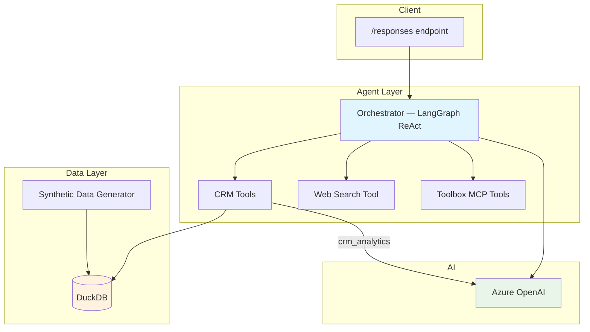

# Insurance CRM Agent — LangGraph + DuckDB + Foundry Toolbox

[](https://langchain-ai.github.io/langgraph/) [](https://duckdb.org/) [](https://azure.microsoft.com/services/openai/)

A LangGraph ReAct agent with a **custom DuckDB-backed CRM tool** for insurance analytics, deployed on **Microsoft Foundry** with optional toolbox MCP integration.

## Features

- **Synthetic insurance data** — generates 1,000 customers, ~2,500 policies, and ~900 claims using `faker` + `duckdb`
- **5 CRM tools** — customer search (by name/ID), policy lookup, customer listing, and a natural-language-to-SQL analytics tool
- **Toolbox MCP integration** — connects to Foundry toolbox for additional tools (web search, code interpreter, AI search)
- **Responses Protocol** — serves requests on port `8088` via `ResponsesAgentServerHost`
- **Multi-turn conversation** — maintains context across turns with history support

## Architecture



## CRM Tools

| Tool | Description |
|------|-------------|
| `crm_search_name` | Search customers by name (case-insensitive, partial match) |
| `crm_search_id` | Look up a customer by numeric ID |
| `crm_get_policies` | Get full policy details for a customer |
| `crm_list_customers` | List customers with summary info (first 50) |
| `crm_analytics` | Natural-language-to-SQL analytics (LLM-powered) |

### Example Analytics Queries

- "How many customers do we have?"
- "What is the total coverage amount by policy type?"
- "Show me all pending claims"
- "What is the loss ratio for each policy type?"
- "Which customer has the highest claim amount?"

## Quick Start (Local)

```bash
# 1. Copy and fill in the environment file
cp .env.example .env
# Edit .env — set FOUNDRY_PROJECT_ENDPOINT and AZURE_AI_MODEL_DEPLOYMENT_NAME

# 2. Install dependencies
pip install -r requirements.txt

# 3. Generate synthetic insurance data
python generate_synthetic_data.py --db-path insurance_data.db

# 4. Start the agent
python main.py

# 5. Invoke
curl -X POST http://localhost:8088/responses \
  -H "Content-Type: application/json" \
  -d '{"input": "Search for customers named Smith"}'
```

## Deploy as a Hosted Agent

### Prerequisites

- Azure Developer CLI (`azd`) — [install docs](https://learn.microsoft.com/azure/developer/azure-developer-cli/install-azd)
- AI Agents extension: `azd extension install azure.ai.agents`
- Azure login: `azd auth login`

### Deploy

```bash
# 1. Set required environment variables
azd env set enableHostedAgentVNext "true" -e my-env
azd env set AZURE_AI_MODEL_DEPLOYMENT_NAME "gpt-4o" -e my-env

# 2. Provision infrastructure and deploy
azd up -e my-env

# 3. Invoke the deployed agent
azd ai agent invoke --new-session "How many customers do we have?" --timeout 120
```

> The Docker build automatically generates synthetic data — no manual step needed when deploying.

## Environment Variables

| Variable | Required | Description |
|----------|----------|-------------|
| `FOUNDRY_PROJECT_ENDPOINT` | **Yes** | Foundry project endpoint — platform-injected at runtime |
| `AZURE_AI_MODEL_DEPLOYMENT_NAME` | **Yes** | Model deployment name (e.g. `gpt-4o`) |
| `TOOLBOX_NAME` | No | Toolbox name — constructs the MCP endpoint automatically |
| `TOOLBOX_ENDPOINT` | No | Full toolbox MCP endpoint URL (alternative to `TOOLBOX_NAME`) |
| `CRM_DB_PATH` | No | Path to the DuckDB database (default: `insurance_data.db`) |

## Project Structure

```
├── main.py                      # Agent entry point + Responses Protocol server
├── orchestrator.py              # LangGraph ReAct agent builder (CRM + toolbox tools)
├── generate_synthetic_data.py   # Faker + DuckDB synthetic data generator
├── agents/
│   └── crm/
│       ├── agent.py             # CRM agent module
│       ├── tools.py             # 5 DuckDB-backed CRM tools
│       └── SKILL.md             # CRM skill instructions
├── tools/
│   └── web_search.py            # Bing web search via Azure OpenAI Responses API
├── SYSTEM_PROMPT.md             # Agent system prompt
├── agent.yaml                   # Foundry agent definition
├── agent.manifest.yaml          # Toolbox manifest (web_search, code_interpreter, ai_search)
├── Dockerfile                   # Container build (includes data generation)
├── requirements.txt             # Python dependencies
└── azure.yaml                   # azd deployment configuration
```

## Database Schema

The DuckDB database contains three tables:

- **customers** — `customer_id`, `first_name`, `last_name`, `email`, `phone`, `date_of_birth`, `address`, `city`, `state`, `zip_code`
- **policies** — `policy_id`, `customer_id`, `policy_type` (auto/home/travel/life), `coverage_amount`, `premium_amount`, `start_date`, `end_date`, `status`
- **claims** — `claim_id`, `policy_id`, `claim_amount`, `claim_date`, `claim_status`, `claim_type`, `description`

## Toolbox Configuration

The toolbox is configured in `azure.yaml` and `agent.manifest.yaml`. The manifest declares tools in the `agent-tools` toolbox: `web_search`, `code_interpreter`, and `azure_ai_search`. These are **optional** — the CRM tools work independently of the toolbox.

## Contributing

This project welcomes contributions and suggestions.

## License

See [LICENSE.md](LICENSE.md).

