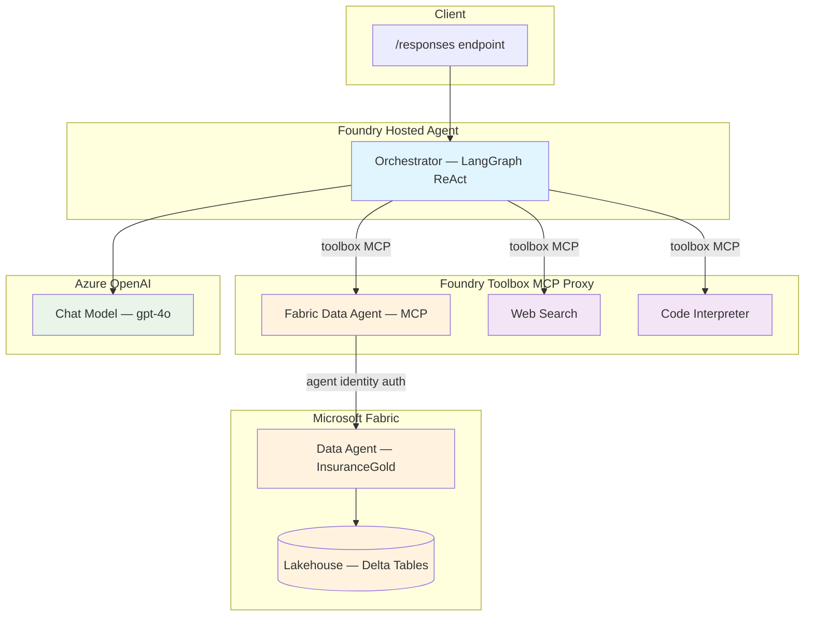

# Fabric Data Agent — LangGraph + Foundry Toolbox

[](https://langchain-ai.github.io/langgraph/) [](https://www.microsoft.com/microsoft-fabric) [](https://azure.microsoft.com/services/openai/)

A LangGraph ReAct agent deployed on **Microsoft Foundry** that queries insurance data through a **Microsoft Fabric Data Agent** (connected via MCP through the Foundry toolbox) and augments responses with platform-managed tools (web search, code interpreter).

## Features

- **Fabric Data Agent (MCP via Toolbox)** — queries Fabric data using natural language through an MCP tool managed by the Foundry toolbox with agent-identity authentication
- **Foundry Toolbox** — all tools (Fabric Data Agent, web search, code interpreter) are platform-managed via a single MCP proxy endpoint
- **Zero in-app auth code** — the Foundry platform handles token acquisition and MCP proxying using the agent's identity
- **Responses Protocol** — serves requests on port `8088` via `ResponsesAgentServerHost`
- **Multi-turn conversation** — maintains context across turns with history support

## Architecture



## How It Works

The agent code itself contains **no Fabric-specific logic**. All data access is handled by the Foundry toolbox:

1. The agent connects to a single **Foundry Toolbox MCP endpoint** at startup
2. The toolbox exposes the **Fabric Data Agent** as an MCP tool (`DataAgent_insurance360`) alongside web search and code interpreter
3. When the agent calls the Fabric tool, the **Foundry platform acquires a token** using the agent's identity and proxies the MCP request to the Fabric Data Agent
4. The Fabric Data Agent translates natural language queries into SQL, executes them, and returns results

## Quick Start (Local)

```bash
# 1. Copy and fill in the environment file
cp .env.example .env
# Edit .env — set FOUNDRY_PROJECT_ENDPOINT, AZURE_AI_MODEL_DEPLOYMENT_NAME, TOOLBOX_NAME

# 2. Install dependencies
pip install -r requirements.txt

# 3. Start the agent
python main.py

# 4. Invoke
curl -X POST http://localhost:8088/responses \
  -H "Content-Type: application/json" \
  -d '{"input": "What tables are available in the data?"}'
```

## Deploy as a Hosted Agent

### Prerequisites

- Azure Developer CLI (`azd`) — [install docs](https://learn.microsoft.com/azure/developer/azure-developer-cli/install-azd)
- AI Agents extension: `azd extension install azure.ai.agents`
- Azure login: `azd auth login`
- An Azure AI Foundry project in a [supported region](https://learn.microsoft.com/azure/ai-foundry/agents/concepts/hosted-agents) (e.g. `eastus2`)
- An Azure Container Registry (ACR) with the project's managed identities granted `AcrPull`
- A Fabric Data Agent configured in a Fabric workspace

### Deploy

```bash
# 1. Initialize azd environment
azd init -e my-env

# 2. Set required environment variables
azd env set AZURE_AI_MODEL_DEPLOYMENT_NAME "gpt-4o" -e my-env
azd env set TOOLBOX_NAME "agent-tools" -e my-env

# 3. Provision infrastructure and deploy
azd up -e my-env

# 4. Invoke the deployed agent
azd ai agent invoke --new-session "What data is available?" --timeout 120
```

## Adding a Fabric Data Agent to the Foundry Toolbox

This is the key integration step — connecting a Fabric Data Agent as an MCP tool in the Foundry toolbox so the hosted agent can query Fabric data using its managed identity.

### Step 1: Create a Fabric Data Agent

1. Open [Microsoft Fabric](https://app.fabric.microsoft.com) → your workspace
2. Click **+ New** → **Data Agent** (preview)
3. Select the lakehouse or warehouse tables to expose
4. Publish the Data Agent
5. Copy the **MCP endpoint URL** from the Data Agent settings:
   ```
   https://api.fabric.microsoft.com/v1/mcp/workspaces/<workspace-id>/dataagents/<dataagent-id>/agent
   ```

### Step 2: Create a Connection in the Foundry Project

Create a connection in your AI Foundry project that points to the Fabric Data Agent MCP endpoint. This connection uses `UserEntraToken` authentication — the Foundry toolbox proxy will exchange the calling user's token for a Fabric-scoped token at runtime.

**Via ARM REST API:**
```bash
ARM_TOKEN=$(az account get-access-token --resource https://management.azure.com --query accessToken -o tsv)
CONNECTION_ID="/subscriptions/<sub-id>/resourceGroups/<rg>/providers/Microsoft.CognitiveServices/accounts/<resource>/projects/<project>/connections/fabric-data-agent-conn"

curl -X PUT "https://management.azure.com${CONNECTION_ID}?api-version=2025-06-01" \
  -H "Authorization: Bearer $ARM_TOKEN" \
  -H "Content-Type: application/json" \
  -d '{
    "properties": {
      "authType": "UserEntraToken",
      "category": "RemoteTool",
      "target": "<your-fabric-mcp-endpoint-url>",
      "audience": "https://api.fabric.microsoft.com",
      "metadata": { "type": "fabric_dataagent" }
    }
  }'
```

### Step 3: Register the MCP Tool in the Toolbox

In `agent.manifest.yaml`, add the Fabric Data Agent as an MCP tool in the toolbox:

```yaml
resources:
  - kind: toolbox
    name: agent-tools
    tools:
      - type: web_search
      - type: code_interpreter
      - type: mcp
        server_label: fabric-data-agent
        project_connection_id: fabric_dataagent_insurance360  # connection name from Step 2
```

Then deploy:
```bash
azd deploy <service-name> --no-prompt
```

After deploying, update the toolbox version via REST API to include the MCP tool:

```bash
TOKEN=$(az account get-access-token --resource https://ai.azure.com --query accessToken -o tsv)
PROJECT_ENDPOINT="<your-project-endpoint>"

curl -X POST "$PROJECT_ENDPOINT/toolboxes/agent-tools/versions?api-version=v1" \
  -H "Authorization: Bearer $TOKEN" \
  -H "Content-Type: application/json" \
  -H "Foundry-Features: Toolboxes=V1Preview" \
  -d '{
    "tools": [
      {"type": "web_search", "name": "web_search"},
      {"type": "code_interpreter", "name": "code_interpreter"},
      {"type": "mcp", "name": "fabric-data-agent", "server_label": "fabric-data-agent", "project_connection_id": "fabric_dataagent_insurance360"}
    ]
  }'
```

Then set it as the default version:
```bash
curl -X PATCH "$PROJECT_ENDPOINT/toolboxes/agent-tools?api-version=v1" \
  -H "Authorization: Bearer $TOKEN" \
  -H "Content-Type: application/json" \
  -H "Foundry-Features: Toolboxes=V1Preview" \
  -d '{"default_version": "<new-version-number>"}'
```

### Step 4: Grant Agent Identities Access to the Fabric Workspace

After deployment, the hosted agent runs with two managed identities. **Both must be granted access** to the Fabric workspace.

#### 4a. Get the Agent Identity Principal IDs

```bash
az rest --method GET \
  --url "<project-endpoint>/agents/<agent-name>?api-version=v1" \
  --resource "https://ai.azure.com"
```

From the response, note:
- **Instance identity** `principal_id`
- **Blueprint identity** `principal_id`

#### 4b. Add Both Identities to the Fabric Workspace

1. Open your Fabric workspace → **Manage access**
2. Click **Add people or groups**
3. Search for each principal ID (they appear as service principals)
4. Grant **Contributor** role (or higher) to both

#### 4c. Verify

```bash
azd ai agent invoke --new-session "What data tables are available?" --timeout 120
```

## Environment Variables

| Variable | Required | Description |
|----------|----------|-------------|
| `FOUNDRY_PROJECT_ENDPOINT` | **Yes** | Foundry project endpoint — platform-injected at runtime |
| `AZURE_AI_MODEL_DEPLOYMENT_NAME` | **Yes** | Model deployment name (e.g. `gpt-4o`) |
| `TOOLBOX_NAME` | **Yes** | Toolbox name (e.g. `agent-tools`) — constructs the MCP endpoint automatically |
| `TOOLBOX_ENDPOINT` | No | Full toolbox MCP endpoint URL (alternative to `TOOLBOX_NAME`) |

## Project Structure

```
├── main.py                      # Agent entry point, toolbox MCP connection, Responses server
├── orchestrator.py              # LangGraph ReAct agent builder
├── SYSTEM_PROMPT.md             # Agent system prompt
├── agent.yaml                   # Foundry hosted agent definition
├── agent.manifest.yaml          # Toolbox manifest (Fabric Data Agent MCP + web_search + code_interpreter)
├── Dockerfile                   # Container build
├── requirements.txt             # Python dependencies
└── azure.yaml                   # azd deployment configuration
```

## Toolbox Configuration

The Foundry toolbox is configured in `agent.manifest.yaml` and manages all tools:

| Tool | Type | Source |
|------|------|--------|
| Fabric Data Agent | `mcp` | Fabric Data Agent via MCP with agent-identity auth |
| Web Search | `web_search` | Platform-managed (Bing) |
| Code Interpreter | `code_interpreter` | Platform-managed (sandboxed Python) |

## Sample Queries

```
"What data tables are available?"
"What is the average commission percentage across all product types?"
"Show me the top 5 insurance agents by total sales amount"
"Which offices have the most claims filed?"
"Compare claims count by product type"
```

## Contributing

This project welcomes contributions and suggestions.

## License

See [LICENSE.md](LICENSE.md).
