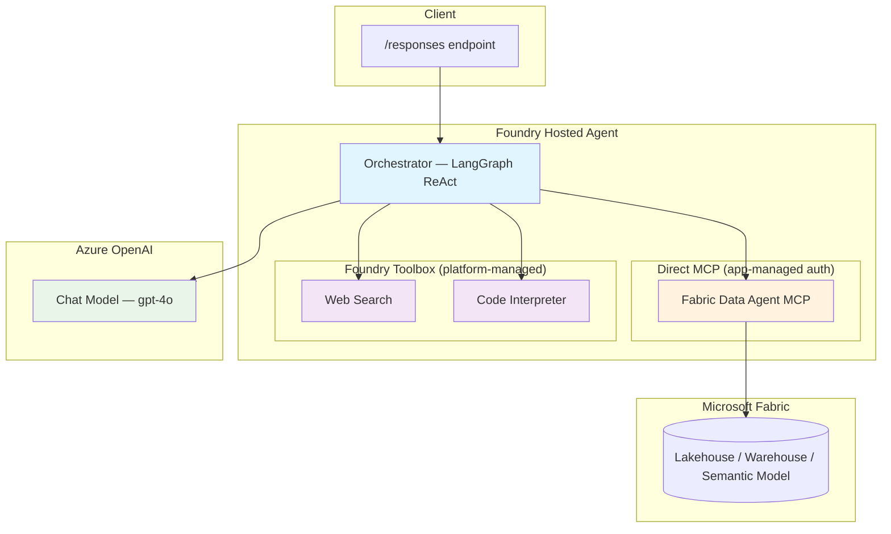

# Fabric Data Agent — LangGraph + MCP + Foundry Toolbox

[](https://langchain-ai.github.io/langgraph/) [](https://www.microsoft.com/microsoft-fabric) [](https://azure.microsoft.com/services/openai/)

A LangGraph ReAct agent deployed on **Microsoft Foundry** that queries data through a **Microsoft Fabric Data Agent** (via MCP) and augments responses with platform-managed tools (web search, code interpreter) from the Foundry toolbox.

## Features

- **Fabric Data Agent (MCP)** — queries data in Fabric lakehouses, warehouses, and semantic models through the Fabric Data Agent's MCP-compatible endpoint
- **Foundry Toolbox** — platform-managed `web_search` and `code_interpreter` tools via the Foundry toolbox MCP proxy
- **Hybrid architecture** — Fabric Data Agent connected directly with app-managed auth; toolbox tools managed by the platform
- **Responses Protocol** — serves requests on port `8088` via `ResponsesAgentServerHost`
- **Multi-turn conversation** — maintains context across turns with history support
- **Graceful fallback** — each MCP connection is independent; a failure in one doesn't block the other

## Architecture



## Quick Start (Local)

```bash
# 1. Copy and fill in the environment file
cp .env.example .env
# Edit .env — set FOUNDRY_PROJECT_ENDPOINT, AZURE_AI_MODEL_DEPLOYMENT_NAME,
# and FABRIC_MCP_ENDPOINT

# 2. Install dependencies
pip install -r requirements.txt

# 3. Start the agent
python main.py

# 4. Invoke
curl -X POST http://localhost:8088/responses \
  -H "Content-Type: application/json" \
  -d '{"input": "What tables are available in the data?"}'
```

## Deploy as a Hosted Agent

### Prerequisites

- Azure Developer CLI (`azd`) — [install docs](https://learn.microsoft.com/azure/developer/azure-developer-cli/install-azd)
- AI Agents extension: `azd extension install azure.ai.agents`
- Azure login: `azd auth login`
- An Azure AI Foundry project in a [supported region](https://learn.microsoft.com/azure/ai-foundry/agents/concepts/hosted-agents) (e.g. `eastus2`)
- An Azure Container Registry (ACR) with the project's managed identities granted `AcrPull` / `Container Registry Repository Reader`

### Deploy

```bash
# 1. Initialize azd environment
azd init -e my-env

# 2. Set required environment variables
azd env set AZURE_AI_MODEL_DEPLOYMENT_NAME "gpt-4o" -e my-env
azd env set FABRIC_MCP_ENDPOINT "https://api.fabric.microsoft.com/v1/mcp/workspaces/<workspace-id>/dataagents/<dataagent-id>/agent" -e my-env
azd env set TOOLBOX_NAME "agent-tools" -e my-env

# 3. Provision infrastructure and deploy
azd up -e my-env

# 4. Invoke the deployed agent
azd ai agent invoke --new-session "What data is available?" --timeout 120
```

## Adding a Fabric Data Agent

This section explains how to configure and connect a Microsoft Fabric Data Agent as a tool in the hosted agent.

### Step 1: Get the Fabric Data Agent MCP Endpoint

1. Open [Microsoft Fabric](https://app.fabric.microsoft.com)
2. Navigate to your workspace → **Data Agent**
3. Select your Data Agent and open its settings
4. Copy the **MCP endpoint URL** — it follows this format:
   ```
   https://api.fabric.microsoft.com/v1/mcp/workspaces/<workspace-id>/dataagents/<dataagent-id>/agent
   ```

### Step 2: Verify the MCP Endpoint Works

Test the endpoint locally before deploying:

```bash
# Get a token
TOKEN=$(az account get-access-token --resource https://api.fabric.microsoft.com --query accessToken -o tsv)

# Initialize MCP session
curl -sS -X POST "<your-fabric-mcp-endpoint>" \
  -H "Authorization: Bearer $TOKEN" \
  -H "Content-Type: application/json" \
  -d '{"jsonrpc":"2.0","id":1,"method":"initialize","params":{"protocolVersion":"2024-11-05","capabilities":{},"clientInfo":{"name":"test","version":"0.1"}}}'

# List available tools
curl -sS -X POST "<your-fabric-mcp-endpoint>" \
  -H "Authorization: Bearer $TOKEN" \
  -H "Content-Type: application/json" \
  -d '{"jsonrpc":"2.0","id":2,"method":"tools/list","params":{}}'
```

You should see a response like:
```json
{"result":{"tools":[{"name":"DataAgent_insurance360","description":"","inputSchema":{"type":"object","properties":{"userQuestion":{"type":"string"}},"required":["userQuestion"]}}]}}
```

### Step 3: Set the Environment Variable

```bash
azd env set FABRIC_MCP_ENDPOINT "https://api.fabric.microsoft.com/v1/mcp/workspaces/<workspace-id>/dataagents/<dataagent-id>/agent"
```

### Step 4: Deploy the Agent

```bash
azd deploy <agent-name> --no-prompt
```

### Step 5: Grant Fabric Workspace Access to Agent Identities (Critical)

After deployment, the hosted agent runs with two managed identities. **Both must be granted access to the Fabric workspace**, otherwise the Fabric MCP endpoint returns `401 Unauthorized` (`TokenIsMissing`).

#### 5a. Get the Agent Identity Principal IDs

```bash
# Get agent details — look for instance_identity and blueprint
az rest --method GET \
  --url "<project-endpoint>/hosted-agents/<agent-name>?api-version=2025-05-15-preview" \
  --resource "https://ai.azure.com"
```

From the response, note two principal IDs:
- **Instance identity** `principal_id` — the per-agent managed identity
- **Blueprint** `principal_id` — the shared infrastructure identity

#### 5b. Add Both Identities as Contributors in the Fabric Workspace

You can do this via the [Fabric portal](https://app.fabric.microsoft.com) or the Fabric REST API:

**Option A — Fabric Portal:**
1. Open your Fabric workspace → **Manage access**
2. Click **Add people or groups**
3. Search for each principal ID (they appear as service principals)
4. Grant **Contributor** role to both

**Option B — Fabric REST API:**

```bash
TOKEN=$(az account get-access-token --resource https://api.fabric.microsoft.com --query accessToken -o tsv)
WORKSPACE_ID="<your-fabric-workspace-id>"

# Grant Contributor to instance identity
curl -X POST "https://api.fabric.microsoft.com/v1/workspaces/$WORKSPACE_ID/roleAssignments" \
  -H "Authorization: Bearer $TOKEN" \
  -H "Content-Type: application/json" \
  -d '{"principal":{"id":"<instance-principal-id>","type":"ServicePrincipal"},"role":"Contributor"}'

# Grant Contributor to blueprint identity
curl -X POST "https://api.fabric.microsoft.com/v1/workspaces/$WORKSPACE_ID/roleAssignments" \
  -H "Authorization: Bearer $TOKEN" \
  -H "Content-Type: application/json" \
  -d '{"principal":{"id":"<blueprint-principal-id>","type":"ServicePrincipal"},"role":"Contributor"}'
```

Both calls should return `201 Created`.

#### 5c. Verify Access

Invoke the agent — it should now connect to Fabric and load tools:

```bash
azd ai agent invoke --new-session "What data tables are available?" --timeout 120
```

In the agent logs you should see:
```
Loaded 1 Fabric tools: ['DataAgent_insurance360']
```

### Why Two Identities?

| Identity | Purpose | Why It Needs Fabric Access |
|----------|---------|---------------------------|
| **Instance identity** | Per-agent identity used at runtime to call external services | Used by `DefaultAzureCredential` in the container to get Fabric tokens |
| **Blueprint identity** | Shared infrastructure identity for the agent platform | Used by the platform for container lifecycle and service mesh operations |

> **Note:** The Foundry toolbox MCP proxy does not yet support `managed_identity` auth for external MCP servers. That's why this agent connects to Fabric **directly** with app-managed `_FabricTokenAuth` rather than routing through the toolbox. The toolbox handles `web_search` and `code_interpreter` only.

## Environment Variables

| Variable | Required | Description |
|----------|----------|-------------|
| `FOUNDRY_PROJECT_ENDPOINT` | **Yes** | Foundry project endpoint — platform-injected at runtime |
| `AZURE_AI_MODEL_DEPLOYMENT_NAME` | **Yes** | Model deployment name (e.g. `gpt-4o`) |
| `FABRIC_MCP_ENDPOINT` | **Yes** | Fabric Data Agent MCP endpoint URL |
| `TOOLBOX_NAME` | No | Toolbox name — constructs the MCP endpoint automatically |
| `TOOLBOX_ENDPOINT` | No | Full toolbox MCP endpoint URL (alternative to `TOOLBOX_NAME`) |

## Project Structure

```
├── main.py                      # Agent entry point, MCP connections, Responses Protocol server
├── orchestrator.py              # LangGraph ReAct agent builder (MCP + web search tools)
├── tools/
│   └── web_search.py            # Bing web search via Azure OpenAI Responses API
├── SYSTEM_PROMPT.md             # Agent system prompt
├── agent.yaml                   # Foundry hosted agent definition
├── agent.manifest.yaml          # Toolbox manifest (web_search, code_interpreter)
├── Dockerfile                   # Container build
├── requirements.txt             # Python dependencies
└── azure.yaml                   # azd deployment configuration
```

## Toolbox Configuration

The Foundry toolbox is configured in `agent.manifest.yaml`. It declares two platform-managed tools in the `agent-tools` toolbox:

| Tool | Type | Source |
|------|------|--------|
| Web Search | `web_search` | Platform-managed (Bing) |
| Code Interpreter | `code_interpreter` | Platform-managed (sandboxed Python) |

These tools are served via the toolbox MCP proxy at `{project_endpoint}/toolboxes/agent-tools/mcp?api-version=v1`. The agent connects to this endpoint with an Azure AD token scoped to `https://ai.azure.com/.default`.

> The Fabric Data Agent is **not** in the toolbox — it's connected directly from app code because the toolbox MCP proxy doesn't yet forward managed identity tokens to external MCP servers.

## Sample Queries

Once deployed with Fabric access configured, try these queries:

```
"What data tables are available?"
"What is the average commission percentage across all product types?"
"Compare the loss ratio and expense ratio across different insurance product types"
"Show me the top agents by total sales amount"
"Which offices have the most claims filed?"
```

## Contributing

This project welcomes contributions and suggestions.

## License

See [LICENSE.md](LICENSE.md).
