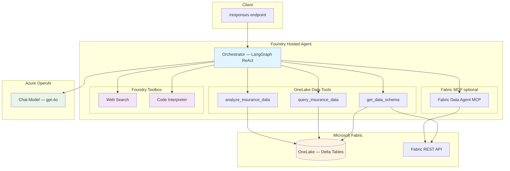

# Fabric Data Agent — LangGraph + OneLake + Foundry Toolbox

[](https://langchain-ai.github.io/langgraph/) [](https://www.microsoft.com/microsoft-fabric) [](https://azure.microsoft.com/services/openai/)

A LangGraph ReAct agent deployed on **Microsoft Foundry** that reads insurance data directly from **Microsoft Fabric OneLake** (delta tables) and augments responses with platform-managed tools (web search, code interpreter) from the Foundry toolbox.

## Features

- **OneLake Delta Table Tools** — reads lakehouse delta tables directly via the `deltalake` library and Fabric REST API for schema discovery
- **Fabric Data Agent (MCP)** — optional connection to Fabric Data Agent for metadata queries
- **Foundry Toolbox** — platform-managed `web_search` and `code_interpreter` tools via the Foundry toolbox MCP proxy
- **Hybrid architecture** — OneLake data access + Fabric MCP + toolbox tools, each independent
- **Responses Protocol** — serves requests on port `8088` via `ResponsesAgentServerHost`
- **Multi-turn conversation** — maintains context across turns with history support

## Architecture



## Why OneLake Instead of Power BI / Fabric MCP?

When running as a Foundry hosted agent with managed identity authentication:

| Approach | Metadata Queries | Data Queries | Status |
|----------|-----------------|--------------|--------|
| **Fabric Data Agent MCP** | ✅ Works | ❌ Fails (OBO doesn't work with managed identity) | Metadata only |
| **Power BI executeQueries API** | ✅ Works | ❌ 401 `PowerBINotAuthorizedException` | Doesn't accept managed identity tokens |
| **OneLake Delta Tables** | ✅ Via Fabric REST API | ✅ Works with storage tokens | **Used by this agent** |

The root cause is that both the Power BI REST API and the Fabric Data Agent's internal OBO (On-Behalf-Of) flow require app-registration service principals or user tokens — they do not accept managed identity tokens for data execution. OneLake's storage API (`https://storage.azure.com/.default`) works correctly with managed identities.

## Quick Start (Local)

```bash
# 1. Copy and fill in the environment file
cp .env.example .env
# Edit .env — set FOUNDRY_PROJECT_ENDPOINT, AZURE_AI_MODEL_DEPLOYMENT_NAME,
# FABRIC_WORKSPACE_ID, and FABRIC_LAKEHOUSE_ID

# 2. Install dependencies
pip install -r requirements.txt

# 3. Start the agent
python main.py

# 4. Invoke
curl -X POST http://localhost:8088/responses \
  -H "Content-Type: application/json" \
  -d '{"input": "What tables are available in the data?"}'
```

## Deploy as a Hosted Agent

### Prerequisites

- Azure Developer CLI (`azd`) — [install docs](https://learn.microsoft.com/azure/developer/azure-developer-cli/install-azd)
- AI Agents extension: `azd extension install azure.ai.agents`
- Azure login: `azd auth login`
- An Azure AI Foundry project in a [supported region](https://learn.microsoft.com/azure/ai-foundry/agents/concepts/hosted-agents) (e.g. `eastus2`)
- An Azure Container Registry (ACR) with the project's managed identities granted `AcrPull` / `Container Registry Repository Reader`
- A Fabric workspace with a lakehouse containing delta tables

### Deploy

```bash
# 1. Initialize azd environment
azd init -e my-env

# 2. Set required environment variables
azd env set AZURE_AI_MODEL_DEPLOYMENT_NAME "gpt-4o" -e my-env
azd env set FABRIC_WORKSPACE_ID "<your-fabric-workspace-id>" -e my-env
azd env set FABRIC_LAKEHOUSE_ID "<your-fabric-lakehouse-id>" -e my-env
azd env set TOOLBOX_NAME "agent-tools" -e my-env

# Optional: Fabric Data Agent MCP for metadata queries
azd env set FABRIC_MCP_ENDPOINT "https://api.fabric.microsoft.com/v1/mcp/workspaces/<workspace-id>/dataagents/<dataagent-id>/agent" -e my-env

# 3. Provision infrastructure and deploy
azd up -e my-env

# 4. Invoke the deployed agent
azd ai agent invoke --new-session "What data is available?" --timeout 120
```

## Connecting to Fabric OneLake

### Step 1: Get Workspace and Lakehouse IDs

1. Open [Microsoft Fabric](https://app.fabric.microsoft.com)
2. Navigate to your workspace — the **workspace ID** is in the URL:
   ```
   https://app.fabric.microsoft.com/groups/<workspace-id>/...
   ```
3. Open your lakehouse — the **lakehouse ID** is in the URL:
   ```
   https://app.fabric.microsoft.com/groups/<workspace-id>/lakehouses/<lakehouse-id>
   ```

### Step 2: Grant Agent Identities Access to the Fabric Workspace

After deployment, the hosted agent runs with two managed identities. **Both must be granted access** to the Fabric workspace for OneLake reads and Fabric REST API calls.

#### 2a. Get the Agent Identity Principal IDs

```bash
az rest --method GET \
  --url "<project-endpoint>/agents/<agent-name>?api-version=2025-05-15-preview" \
  --resource "https://ai.azure.com"
```

From the response, note two principal IDs:
- **Instance identity** `principal_id` — the per-agent managed identity
- **Blueprint identity** `principal_id` — the shared infrastructure identity

#### 2b. Add Both Identities to the Fabric Workspace

**Via Fabric Portal:**
1. Open your Fabric workspace → **Manage access**
2. Click **Add people or groups**
3. Search for each principal ID (they appear as service principals)
4. Grant **Contributor** role (or higher) to both

**Via Fabric REST API:**

```bash
TOKEN=$(az account get-access-token --resource https://api.fabric.microsoft.com --query accessToken -o tsv)
WORKSPACE_ID="<your-fabric-workspace-id>"

# Grant Contributor to instance identity
curl -X POST "https://api.fabric.microsoft.com/v1/workspaces/$WORKSPACE_ID/roleAssignments" \
  -H "Authorization: Bearer $TOKEN" \
  -H "Content-Type: application/json" \
  -d '{"principal":{"id":"<instance-principal-id>","type":"ServicePrincipal"},"role":"Contributor"}'

# Grant Contributor to blueprint identity
curl -X POST "https://api.fabric.microsoft.com/v1/workspaces/$WORKSPACE_ID/roleAssignments" \
  -H "Authorization: Bearer $TOKEN" \
  -H "Content-Type: application/json" \
  -d '{"principal":{"id":"<blueprint-principal-id>","type":"ServicePrincipal"},"role":"Contributor"}'
```

#### 2c. Enable OneLake for Third-Party Access

In the Fabric Admin Portal, ensure **OneLake settings > Users can access data stored in OneLake with apps external to the Fabric environment** is enabled.

### Step 3: Verify Connectivity

```bash
azd ai agent invoke --new-session "What data tables are available?" --timeout 120
```

You should see the agent list all lakehouse tables with their schemas.

### Why Two Identities?

| Identity | Purpose | Why It Needs Fabric Access |
|----------|---------|---------------------------|
| **Instance identity** | Per-agent identity used at runtime | Used by `DefaultAzureCredential` to get storage and Fabric API tokens |
| **Blueprint identity** | Shared infrastructure identity | Used by the platform for container lifecycle and service mesh operations |

## Adding a Fabric Data Agent (Optional — Metadata Only)

The Fabric Data Agent MCP can optionally be connected for metadata queries (e.g., listing available tables). **It cannot execute data queries with managed identity tokens** — the agent uses OneLake delta table tools for all data access.

1. Open [Microsoft Fabric](https://app.fabric.microsoft.com) → your workspace → **Data Agent**
2. Copy the MCP endpoint URL:
   ```
   https://api.fabric.microsoft.com/v1/mcp/workspaces/<workspace-id>/dataagents/<dataagent-id>/agent
   ```
3. Set the environment variable:
   ```bash
   azd env set FABRIC_MCP_ENDPOINT "<your-fabric-mcp-endpoint>"
   ```

## Environment Variables

| Variable | Required | Description |
|----------|----------|-------------|
| `FOUNDRY_PROJECT_ENDPOINT` | **Yes** | Foundry project endpoint — platform-injected at runtime |
| `AZURE_AI_MODEL_DEPLOYMENT_NAME` | **Yes** | Model deployment name (e.g. `gpt-4o`) |
| `FABRIC_WORKSPACE_ID` | **Yes** | Fabric workspace ID for OneLake access |
| `FABRIC_LAKEHOUSE_ID` | **Yes** | Fabric lakehouse ID containing delta tables |
| `FABRIC_MCP_ENDPOINT` | No | Fabric Data Agent MCP endpoint URL (metadata only) |
| `FABRIC_DATASET_ID` | No | Fabric semantic model ID (for Power BI integration) |
| `TOOLBOX_NAME` | No | Toolbox name — constructs the MCP endpoint automatically |
| `TOOLBOX_ENDPOINT` | No | Full toolbox MCP endpoint URL (alternative to `TOOLBOX_NAME`) |

## Project Structure

```
├── main.py                      # Agent entry point, OneLake tools, MCP connections, Responses server
├── orchestrator.py              # LangGraph ReAct agent builder
├── tools/
│   └── web_search.py            # Bing web search via Azure OpenAI Responses API
├── SYSTEM_PROMPT.md             # Agent system prompt
├── agent.yaml                   # Foundry hosted agent definition
├── agent.manifest.yaml          # Toolbox manifest (web_search, code_interpreter)
├── Dockerfile                   # Container build
├── requirements.txt             # Python dependencies
└── azure.yaml                   # azd deployment configuration
```

## OneLake Data Tools

The agent provides three built-in tools for querying Fabric lakehouse data:

| Tool | Description |
|------|-------------|
| `get_data_schema` | Lists all tables and their column schemas using Fabric REST API + delta table introspection |
| `query_insurance_data` | Reads a specific table with optional column selection and row limits |
| `analyze_insurance_data` | Loads multiple related tables for cross-table analysis (e.g. comparing ratios across product types) |

These tools authenticate via `DefaultAzureCredential` and read delta tables using `abfss://` paths through OneLake's DFS endpoint.

## Toolbox Configuration

The Foundry toolbox is configured in `agent.manifest.yaml`:

| Tool | Type | Source |
|------|------|--------|
| Web Search | `web_search` | Platform-managed (Bing) |
| Code Interpreter | `code_interpreter` | Platform-managed (sandboxed Python) |

## Sample Queries

```
"What data tables are available?"
"What is the average commission percentage across all product types?"
"Compare the loss ratio and expense ratio across different insurance product types"
"Show me the top agents by total sales amount"
"Which offices have the most claims filed?"
```

## Contributing

This project welcomes contributions and suggestions.

## License

See [LICENSE.md](LICENSE.md).
